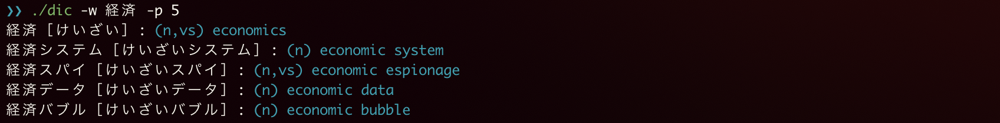
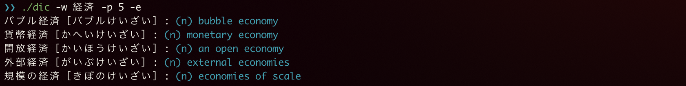
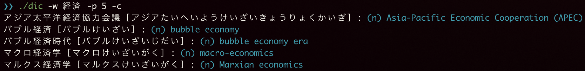

# dic
translate Japanese 2 English using EDICT written in only Go standard Library.

## Usage
```bash
Usage of dic:
  -c	Match specification: CONTAIN   (ANYWHERE)
  -e	Match specification: ENDWITH   (HEADWORD)
  -p int
    	Max result count(default: 3)
  -s	Match specification: STARTWITH (HEADWORD)
  -version
    	Print version information and quit.
  -w string
    	Word translated by
```


Hit On Start With Headword


Hit On End with Headword


Hit On Contain Anywhere



## Installation

```bash
$ git clone https://github.com/ShingoYadomoto/dic.git
$ cd dic
$ go build
$ ./dic -w 経済
```